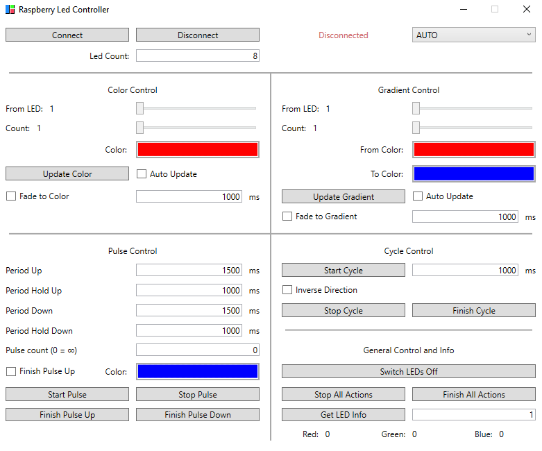

Sorry for the german documentation, this was a school project with weird requirements. Also the codebase is old and young me made some questionable design choices. But maybe it is helpful for somebody. Also this repo is huge because (for some reason idfk) I included the pico-sdk :)

# Serielle NeoPixel Raspberry Pi Pico Schnittstelle
Dieses Projekt kann für die Kontrolle von NeoPixel / WS2812B LED Strips über die serielle Kommunikation durch einen Rapberry Pi Pico verwendet werden.

# Navigation
- [Allgemein](#allgemein)
- [RaspLedController Programm](#raspledcontroller-programm)
- [Bibliotheken](#bibliotheken)
    - [Beispiel Code](#c-beispiel)
    - [Dokumentation C++ Bibliothek](#dokumentation-c-bibliothek)
        - [Allgemein](#allgemein-1)
        - [Setzen einer Farbe](#setzen-einer-farbe)
        - [Animierter Farbübergang](#animierter-farbübergang)
        - [Farbverlauf](#farbverlauf)
        - [Farbverlauf mit animierten Farbübergang](#farbverlauf-mit-animierten-farbübergang)
        - [Pulsieren](#pulsieren)
        - [Kreisbewegung](#kreisbewegung)
    - [Dokumentation C# Bibliothek](#dokumentation-c-bibliothek-1)
        - [Allgemein](#allgemein-2)
        - [Setzen einer Farbe](#setzen-einer-farbe-1)
        - [Animierter Farbübergang](#animierter-farbübergang-1)
        - [Farbverlauf](#farbverlauf-1)
        - [Farbverlauf mit animierten Farbübergang](#farbverlauf-mit-animierten-farbübergang-1)
        - [Pulsieren](#pulsieren-1)
        - [Kreisbewegung](#kreisbewegung-1)
- [Dokumentation Raspberry Pi](#dokumentation-raspberry-pi-pico)
    - [Allgemein](#allgemein-3)
    - [Setzen einer Farbe](#setzen-einer-farbe-2)
    - [Animierter Farbübergang](#animierter-farbübergang-2)
    - [Farbverlauf](#farbverlauf-2)
    - [Farbverlauf mit animierten Farbübergang](#farbverlauf-mit-animierten-farbübergang-2)
    - [Pulsieren](#pulsieren-2)
    - [Kreisbewegung](#kreisbewegung-2)


<br/>

# Allgemein

Daten-Pin: ___GP0___ / ___Pin 1___ 

Baud Rate: ___115200___

Übertragen wird ein String, welcher mit `>` beginnt und mit `;` abgeschlossen wird.\
`Test >SetStaticColor(2,128,0,255); immer mehr Tests` wird somit vom RPI Pico zu `SetStaticColor(2,128,0,255)` geparst und die Funktion SetStaticColor wird ausgeführt.

Leerzeichen werden vom RPI Pico ignoriert. Folgende Befehle sind somit gleichwertig:
* `>SetStaticColor(2,128,0,255);`
* `>Set Static Color (2, 128, 0, 255);`

Alle Rückgabewerte werden als Strings im ASCII Format über den Port geschickt. Begonnen wird mit `>`, terminiert mit `\r\n`.
Der Befehl `>Clear();` liefert z.B. `>true\r\n` bzw. `>false\r\n` zurück.


<br/>

# RaspLedController Programm
RaspLedController ist ein Programm, mit dem sich über eine Oberfläche eine Verbindung zum Raspberry Pi Pico aufbauen lässt. Es sind alle Funktionen, die vom RPI unterstützt werden, implementiert.



<br/>


# Bibliotheken
Es existieren C# (.NET Framework 4.7.2) und C++ (benötigt Boost) Bibliotheken.

Zu jeder Funktion, bei der es sinnvoll ist, gibt es eine `"Async"` Variante. Diese liefert keinen Rückgabewert zurück und ist dafür performanter.
Geplant sind Events, nachdem z.B. ein Fade geendet hat, oder ein vollständiger Zyklus des Cycle-Effekts stattgefunden hat.

### C# Beispiel
```cs
using SerialLedCSharpLib;
```
```cs
LedController ledController = new LedController();

if(!ledController.AutoConnect(16))
    return;

Console.WriteLine(ledController.GetVersion());


ledController.SetGradient(0, 0, 0, 255, 255, 255);
SerialError err;
ledController.StartCycle(5000, true, out err);
```


### C++ Beispiel
```cpp
#include "SerialLedCppLib.h"
```
```cpp
SerialLedCppLib::LedController ledController;


SerialLedCppLib::LedController::SerialError err;
ledController.Connect("COM6", 16, err);

if (err == SerialLedCppLib::LedController::SerialError::None)
    std::cout << "Version: " << ledController.GetVersion() << std::endl;

std::cout << ledController.GetLedCount() << std::endl;
std::cout << ledController.SetStaticColor(255, 255, 255) << std::endl;
std::cout << ledController.GetLedColor(1);
```


<br/>

# Dokumentation C++ Bibliothek

Info: Es wird boost/lockfree/queue.hpp aus der Boost Bibliothek verwendet.

## Allgemein
#### ```enum SerialError```

``` cpp
enum SerialError
{
    None,
    PortError,
    UnexpectedError,
    NotConnected,
    Timeouted,
    TransmitionFailed,
    NothingToRead,
    NothingToWrite,
    HandshakeFailed
}
```
Wird ___optional___ bei Funktionen als Referenz übergeben, um genauere Informationen über die Gültigkeit des Rückgabewertes zu erhalten.
___


```cpp
bool Connect(string port, uint16_t ledCount, [SerialError& err]);
```
Versucht eine Verbindung über den übergebenen Port (z.B. "COM5") aufzubauen. Gibt true zurück, falls erfolgreich. Der Parameter ledCount setzt die Anzahl der LEDs (maximal 1024). "err" beinhaltet weitere Informationen.
___

```cpp
bool AutoConnect(uint16_t ledCount);
```
Versucht einen Port zu finden, an dem ein Raspberry Pi Pico mit der entsprechenden Software zu erreichen ist. Liefert true zurück, wenn eine Verbindung hergestellt wurde, false wenn kein Microcontroller verfügbar ist. Der Parameter ledCount setzt die Anzahl der LEDs (maximal 1024).
___

```cpp
bool Disconnect([SerialError& err]);
```
Baut die Verbindung ab. Alle bis dahin aufgerufenen Funktionen werden zuvor noch vollständig ausgeführt.
___

```cpp
bool IsConnected();
```
Gibt true zurück, wenn eine Verbindung zu einem Raspberry PI Pico mit entsprechender Software existiert.
___

```cpp
uint16_t GetVersion();
```
Gibt die Software Version des Raspberry PI Pico zurück.
___

```cpp
bool Clear([SerialError& err]);
void ClearAsync();
```
Schaltet den gesamten LED Strip aus.
___


```cpp
bool StopAllActions([SerialError& err]);
void StopAllActionsAsync();
```
Hält alle aktuellen Aktionen an. Fades halten in der aktuellen Position.
___

```cpp
bool FinishAllActions([SerialError& err]);
void FinishAllActionsAsync();
```
Hält alle aktuellen Aktionen an. Ein Fade wird abgebrochen und der Endzustand wird angezeigt.
___

```cpp
uint16_t GetLedCount([SerialError& err]);
```
Liefert die Anzahl der LEDs im Strip zurück.
___

```cpp
bool SetLedCount(uint16_t count, [SerialError& err]);
```
Setzt die Anzahl der LEDs. (Maximaler Wert 1024)
___
```cpp
uint32_t GetLedColor(uint16_t ledNumber, [SerialError& err]);
```
Liefert die Farbe der LED der Position ___ledNumber___ zurück.


## Setzen einer Farbe
```cpp
bool SetStaticColor(uint8_t red, uint8_t green, uint8_t blue, [SerialError& err]);
void SetStaticColorAsync(uint8_t red, uint8_t green, uint8_t blue);
```
Setzt den gesamten LED Strip auf die übergebene Farbe.
___

```cpp
bool SetStaticColor(uint16_t ledNumber, uint8_t red, uint8_t green, uint8_t blue, [SerialError& err]);
void SetStaticColorAsync(uint16_t ledNumber, uint8_t red, uint8_t green, uint8_t blue);
```
Setzt die angegebene ___ledNumber___ auf die übergebene Farbe.
___

```cpp
bool SetStaticColor(uint16_t ledNumberFrom, uint16_t count, uint8_t red, uint8_t green, uint8_t blue, [SerialError& err]);
void SetStaticColorAsync(uint16_t ledNumberFrom, uint16_t count, uint8_t red, uint8_t green, uint8_t blue);
```
Setzt eine Reihe von ___count___ LEDs, beginnend bei ___ledNumberFrom___.


## Animierter Farbübergang
```cpp
bool IsFading([SerialError& err]);
```
IsFading gibt ___true___ zurück, wenn ein Farbübergang aktiv ist.
___
```cpp
bool FadeToStaticColor(uint16_t period, uint8_t red, uint8_t green, uint8_t blue, [SerialError& err]);
void FadeToStaticColorAsync(uint16_t period, uint8_t red, uint8_t green, uint8_t blue);
```
Beginnt einen animierten Übergang über den gesamten LED Strip. Dieser beginnt bei der aktuellen Farbe, endet bei der übergebenen Farbe und dauert ___period___ ms an.
___

```cpp
bool FadeToStaticColor(uint16_t period, uint16_t ledNumber, uint8_t red, uint8_t green, uint8_t blue, [SerialError& err]);
void FadeToStaticColorAsync(uint16_t period, uint16_t ledNumber, uint8_t red, uint8_t green, uint8_t blue);
```
Beginnt einen animierten Übergang bei ___ledNumber___. Dieser beginnt bei der aktuellen Farbe, endet bei der übergebenen Farbe und dauert ___period___ ms an.
___

```cpp
bool FadeToStaticColor(uint16_t period, uint16_t ledNumberFrom, uint16_t count, uint8_t red, uint8_t green, uint8_t blue, [SerialError& err]);
void FadeToStaticColorAsync(uint16_t period, uint16_t ledNumber, uint16_t count, uint8_t red, uint8_t green, uint8_t blue);
```
Beginnt einen animierten Übergang, der bei ___ledNumberFrom___ startet und ___count___ LEDs anhält. Dieser beginnt bei der aktuellen Farbe, endet bei der übergebenen Farbe und dauert ___period___ ms an.
___

```cpp
bool StopFade([SerialError& err]);
void StopFadeAsync();
```
Stoppt alle Fades über den gesamten LED Strip.


## Farbverlauf
```cpp
bool SetGradient(uint8_t redStart, uint8_t greenStart, uint8_t blueStart, uint8_t redEnd, uint8_t greenEnd, uint8_t blueEnd, [SerialError& err]);
void SetGradientAsync(uint8_t redStart, uint8_t greenStart, uint8_t blueStart, uint8_t redEnd, uint8_t greenEnd, uint8_t blueEnd);
```
Erzeugt einen Farbverlauf über den gesamten LED Strip. Dieser reicht von ___rgbStart___ bis ___rgbEnd___.
___

```cpp
bool SetGradient(uint16_t ledNumberFrom, uint16_t count, uint8_t redStart, uint8_t greenStart, uint8_t blueStart, uint8_t redEnd, uint8_t greenEnd, uint8_t blueEnd, [SerialError& err]);
void SetGradientAsync(uint16_t ledNumberFrom, uint16_t count, uint8_t redStart, uint8_t greenStart, uint8_t blueStart, uint8_t redEnd, uint8_t greenEnd, uint8_t blueEnd);
```
Erzeugt einen Farbverlauf, der bei ___ledNumberFrom___ startet und ___count___ LEDs anhält. Dieser reicht von ___rgbStart___ bis ___rgbEnd___.


## Farbverlauf mit animierten Farbübergang
```cpp
bool FadeToGradient(uint16_t period, uint8_t redStart, uint8_t greenStart, uint8_t blueStart, uint8_t redEnd, uint8_t greenEnd, uint8_t blueEnd, [out SerialError err]);
void FadeToGradientAsync(uint16_t period, uint8_t redStart, uint8_t greenStart, uint8_t blueStart, uint8_t redEnd, uint8_t greenEnd, uint8_t blueEnd);
```
Geht in ___period___ ms zu einem Farbverlauf über. Dieser reicht von ___rgbStart___ bis ___rgbEnd___.
___

```cpp
bool FadeToGradient(uint16_t period, uint16_t ledNumberFrom, uint16_t count, uint8_t redStart, uint8_t greenStart, uint8_t blueStart, uint8_t redEnd, uint8_t greenEnd, uint8_t blueEnd, [SerialError& err]);
void FadeToGradientAsync(uint16_t period, uint16_t ledNumberFrom, uint16_t count, uint8_t redStart, uint8_t greenStart, uint8_t blueStart, uint8_t redEnd, uint8_t greenEnd, uint8_t blueEnd);
```
Geht in in ___period___ ms zu einem Farbverlauf über, der bei ___ledNumberFrom___ startet und ___count___ LEDs anhält. Dieser reicht von ___rgbStart___ bis ___rgbEnd___.


## Pulsieren
```cpp
bool IsPulsing([SerialError& err]);
```
IsPulsing gibt ___true___ zurück, wenn das Pulsieren aktiv ist.
___
```cpp
bool StopPulse([SerialError& err]);
void StopPulseAsync();
```
Stoppt das Pulsieren.
___
```cpp
bool FinishPulseUp([SerialError& err]);
void FinishPulseUpAsync();
```
Beendet das Pulsieren, die Leds verbleiben in der Farbe, die bei StartPulse angegeben wurde.
___
```cpp
bool FinishPulseDown([SerialError& err]);
void FinishPulseDownAsync();
```
Beendet das Pulsieren, die Leds verbleiben dunkel.
___
```cpp
bool StartPulse(uint16_t periodUp, uint16_t periodHoldUp, uint16_t periodDown, uint16_t periodHoldDown, uint8_t red, uint8_t green, uint8_t blue, [SerialError& err]);
void StartPulseAsync(uint16_t periodUp, uint16_t periodHoldUp, uint16_t periodDown, uint16_t periodHoldDown, uint8_t red, uint8_t green, uint8_t blue);
```
Startet einen pulsierenden Effekt, der anhält, bis eine andere Funktion aufgerufen wird.
___
```cpp
bool StartPulse(uint16_t periodUp, uint16_t periodHoldUp, uint16_t periodDown, uint16_t periodHoldDown, uint16_t pulseCount, bool finishPulseUp, uint8_t red, uint8_t green, uint8_t blue, [SerialError& err]);
void StartPulseAsync(uint16_t periodUp, uint16_t periodHoldUp, uint16_t periodDown, uint16_t periodHoldDown, uint16_t pulseCount, bool finishPulseUp, uint8_t red, uint8_t green, uint8_t blue);
```
Startet einen pulsierenden Effekt, der für ___pulseCount___ Puls anhält. Nach dem letzten Puls bestimmt ___finishPulseUp___ ob die Leds in der angegebenen Farbe leuchten oder nicht.


## Kreisbewegung
```cpp
bool IsCycling([SerialError& err]);
```
IsCycling gibt ___true___ zurück, wenn die Kreisbewegung aktiv ist.
___

```cpp
bool StartCycle(uint16_t period, bool direction, [SerialError& err]);
void StartCycleAsync(uint16_t period, bool direction);
```
Beginnt eine Animation, die die bestehende LED Folge abhängig von ___direction___ in ___period___ ms rotiert.
___

```cpp
bool StopCycle([SerialError& err]);
void StopCycleAsync();
```
Stoppt die Kreisbewegung.
___

```cpp
bool FinishCycle([SerialError& err]);
void FinishCycleAsync();
```
Stoppt die Kreisbewegung, wenn die Rotationsposition den Ausgangspunkt erreicht hat. 


<br/>


# Dokumentation C# Bibliothek

## Allgemein
#### ```enum SerialError```

``` c#
enum SerialError
{
    None,
    PortError,
    UnexpectedError,
    NotConnected,
    Timeouted,
    TransmitionFailed,
    NothingToRead,
    NothingToWrite,
    HandshakeFailed
}
```
Wird ___optional___ bei vielen Funktionen als Verweis mit dem ```out```-Parameter übergeben, um genauere Informationen über die Gültigkeit des Rückgabewertes zu erhalten.
___


```cs
bool Connect(string port, UInt16 ledCount, [out SerialError err]);
```
Versucht eine Verbindung über den übergebenen Port (z.B. "COM5") aufzubauen. Gibt true zurück, falls erfolgreich. Der Parameter ledCount setzt die Anzahl der LEDs (maximal 1024). "err" beinhaltet weitere Informationen.
___

```cs
bool AutoConnect(UInt16 ledCount);
```
Versucht einen Port zu finden, an dem ein Raspberry Pi Pico mit der entsprechenden Software zu erreichen ist. Liefert true zurück, wenn eine Verbindung hergestellt wurde, false wenn kein Microcontroller verfügbar ist. Der Parameter ledCount setzt die Anzahl der LEDs (maximal 1024).
___

```cs
bool Disconnect([out SerialError err]);
```
Baut die Verbindung ab. Alle bis dahin aufgerufenen Funktionen werden zuvor noch vollständig ausgeführt.
___

```cs
bool IsConnected();
```
Gibt true zurück, wenn eine Verbindung zu einem Raspberry PI Pico mit entsprechender Software existiert.
___

```cs
UInt16 GetVersion();
```
Gibt die Software des Raspberry PI Pico zurück.
___

```cs
bool Clear([out SerialError err]);
void ClearAsync();
```
Schaltet den gesamten LED Strip aus.
___


```cs
bool StopAllActions([out SerialError err]);
void StopAllActionsAsync();
```
Hält alle aktuellen Aktionen an. Fades halten in der aktuellen Position.
___

```cs
bool FinishAllActions([out SerialError err]);
void FinishAllActionsAsync();
```
Hält alle aktuellen Aktionen an. Ein Fade wird abgebrochen und der Endzustand wird angezeigt.
___

```cs
UInt16 GetLedCount([out SerialError err]);
```
Liefert die Anzahl der LEDs im Strip zurück.
___

```cs
UInt32 GetLedColor(UInt16 ledNumber, [out SerialError err]);
```
Liefert die Farbe der LED der Position ___ledNumber___ zurück.


## Setzen einer Farbe
```cs
bool SetStaticColor(byte red, byte green, byte blue, [out SerialError err]);
bool SetStaticColor(Color color, [out SerialError err]);
void SetStaticColorAsync(byte red, byte green, byte blue);
void SetStaticColorAsync(Color color);
```
Setzt den gesamten LED Strip auf die übergebene Farbe.
___

```cs
bool SetStaticColor(UInt16 ledNumber, byte red, byte green, byte blue, [out SerialError err]);
bool SetStaticColor(UInt16 ledNumber, Color color, [out SerialError err]);
void SetStaticColorAsync(UInt16 ledNumber, byte red, byte green, byte blue);
void SetStaticColorAsync(UInt16 ledNumber, Color color);
```
Setzt die angegebene ___ledNumber___ auf die übergebene Farbe.
___

```cs
bool SetStaticColor(UInt16 ledNumberFrom, UInt16 count, byte red, byte green, byte blue, [out SerialError err]);
bool SetStaticColor(UInt16 ledNumberFrom, UInt16 count, Color color, [out SerialError err]);
void SetStaticColorAsync(UInt16 ledNumberFrom, UInt16 count, byte red, byte green, byte blue);
void SetStaticColorAsync(UInt16 ledNumberFrom, UInt16 count, Color color);
```
Setzt eine Reihe von ___count___ LEDs, beginnend bei ___ledNumberFrom___.


## Animierter Farbübergang
```cs
bool IsFading([out SerialError err]);
```
IsCycling gibt ___true___ zurück, wenn ein Farbübergang aktiv ist.
___

```cs
bool FadeToStaticColor(UInt16 period, byte red, byte green, byte blue, [out SerialError err]);
bool FadeToStaticColor(UInt16 period, Color color, [out SerialError err]);
void FadeToStaticColorAsync(UInt16 period, byte red, byte green, byte blue);
void FadeToStaticColorAsync(UInt16 period, Color color);
```
Beginnt einen animierten Übergang über den gesamten LED Strip. Dieser beginnt bei der aktuellen Farbe, endet bei der übergebenen Farbe und dauert ___period___ ms an.
___

```cs
bool FadeToStaticColor(UInt16 period, UInt16 ledNumber, byte red, byte green, byte blue, [out SerialError err]);
bool FadeToStaticColor(UInt16 period, UInt16 ledNumber, Color color, [out SerialError err]);
void FadeToStaticColorAsync(UInt16 period, UInt16 ledNumber, byte red, byte green, byte blue);
void FadeToStaticColorAsync(UInt16 period, UInt16 ledNumber, Color color);
```
Beginnt einen animierten Übergang bei ___ledNumber___. Dieser beginnt bei der aktuellen Farbe, endet bei der übergebenen Farbe und dauert ___period___ ms an.
___

```cs
bool FadeToStaticColor(UInt16 period, UInt16 ledNumberFrom, UInt16 count, byte red, byte green, byte blue, [out SerialError err]);
bool FadeToStaticColor(UInt16 period, UInt16 ledNumberFrom, UInt16 count, Color color, [out SerialError err]);
void FadeToStaticColorAsync(UInt16 period, UInt16 ledNumber, UInt16 count, byte red, byte green, byte blue);
void FadeToStaticColorAsync(UInt16 period, UInt16 ledNumber, UInt16 count, Color color);
```
Beginnt einen animierten Übergang, der bei ___ledNumberFrom___ startet und ___count___ LEDs anhält. Dieser beginnt bei der aktuellen Farbe, endet bei der übergebenen Farbe und dauert ___period___ ms an.
___

```cs
bool StopFade([out SerialError err]);
void StopFadeAsync();
```
Stoppt alle Fades über den gesamten LED Strip.


## Farbverlauf
```cs
bool SetGradient(byte redStart, byte greenStart, byte blueStart, byte redEnd, byte greenEnd, byte blueEnd, [out SerialError err]);
bool SetGradient(Color start, Color end, [out SerialError err]);
void SetGradientAsync(byte redStart, byte greenStart, byte blueStart, byte redEnd, byte greenEnd, byte blueEnd);
void SetGradientAsync(Color start, Color end);
```
Erzeugt einen Farbverlauf über den gesamten LED Strip. Dieser reicht von ___rgbStart___ bis ___rgbEnd___.
___

```cs
bool SetGradient(UInt16 ledNumberFrom, UInt16 count, byte redStart, byte greenStart, byte blueStart, byte redEnd, byte greenEnd, byte blueEnd, [out SerialError err]);
bool SetGradient(UInt16 ledNumberFrom, UInt16 count, Color start, Color end, [out SerialError err]);
void SetGradientAsync(UInt16 ledNumberFrom, UInt16 count, byte redStart, byte greenStart, byte blueStart, byte redEnd, byte greenEnd, byte blueEnd);
void SetGradientAsync(UInt16 ledNumberFrom, UInt16 count, Color start, Color end);
```
Erzeugt einen Farbverlauf, der bei ___ledNumberFrom___ startet und ___count___ LEDs anhält. Dieser reicht von ___rgbStart___ bis ___rgbEnd___.


## Farbverlauf mit animierten Farbübergang
```cs
bool FadeToGradient(UInt16 period, byte redStart, byte greenStart, byte blueStart, byte redEnd, byte greenEnd, byte blueEnd, [out SerialError err]);
bool FadeToGradient(UInt16 period, Color start, Color end, [out SerialError err]);
void FadeToGradientAsync(UInt16 period, byte redStart, byte greenStart, byte blueStart, byte redEnd, byte greenEnd, byte blueEnd);
void FadeToGradientAsync(UInt16 period, Color start, Color end);
```
Geht in ___period___ ms zu einem Farbverlauf über. Dieser reicht von ___rgbStart___ bis ___rgbEnd___.
___

```cs
bool FadeToGradient(UInt16 period, UInt16 ledNumberFrom, UInt16 count, byte redStart, byte greenStart, byte blueStart, byte redEnd, byte greenEnd, byte blueEnd, [out SerialError err]);
bool FadeToGradient(UInt16 period, UInt16 ledNumberFrom, UInt16 count, Color start, Color end, [out SerialError err]);
void FadeToGradientAsync(UInt16 period, UInt16 ledNumberFrom, UInt16 count, byte redStart, byte greenStart, byte blueStart, byte redEnd, byte greenEnd, byte blueEnd);
void FadeToGradientAsync(UInt16 period, UInt16 ledNumberFrom, UInt16 count, Color start, Color end);
```
Geht in ___period___ ms zu einem Farbverlauf über, der bei ___ledNumberFrom___ startet und ___count___ LEDs anhält. Dieser reicht von ___rgbStart___ bis ___rgbEnd___.


## Pulsieren
```cs
bool IsPulsing([out SerialError err]);
```
IsPulsing gibt ___true___ zurück, wenn das Pulsieren aktiv ist.
___
```cs
bool StopPulse([out SerialError err]);
void StopPulseAsync();
```
Stoppt das Pulsieren.
___
```cs
bool FinishPulseUp([out SerialError err]);
void FinishPulseUpAsync();
```
Beendet das Pulsieren, die Leds verbleiben in der Farbe, die bei StartPulse angegeben wurde.
___
```cs
bool FinishPulseDown([out SerialError err]);
void FinishPulseDownAsync();
```
Beendet das Pulsieren, die Leds verbleiben dunkel.
___
```cs
bool StartPulse(UInt16 periodUp, UInt16 periodHoldUp, UInt16 periodDown, UInt16 periodHoldDown, byte red, byte green, byte blue, [out SerialError err]);
bool StartPulse(UInt16 periodUp, UInt16 periodHoldUp, UInt16 periodDown, UInt16 periodHoldDown, Color color, [out SerialError err]);
void StartPulseAsync(UInt16 periodUp, UInt16 periodHoldUp, UInt16 periodDown, UInt16 periodHoldDown, byte red, byte green, byte blue);
void StartPulseAsync(UInt16 periodUp, UInt16 periodHoldUp, UInt16 periodDown, UInt16 periodHoldDown, Color color);
```
Startet einen pulsierenden Effekt, der anhält, bis eine andere Funktion aufgerufen wird.
___
```cs
bool StartPulse(UInt16 periodUp, UInt16 periodHoldUp, UInt16 periodDown, UInt16 periodHoldDown, UInt16 pulseCount, bool finishPulseUp, byte red, byte green, byte blue, [out SerialError err]);
bool StartPulse(UInt16 periodUp, UInt16 periodHoldUp, UInt16 periodDown, UInt16 periodHoldDown, UInt16 pulseCount, bool finishPulseUp, Color color, [out SerialError err]);
void StartPulseAsync(UInt16 periodUp, UInt16 periodHoldUp, UInt16 periodDown, UInt16 periodHoldDown, UInt16 pulseCount, bool finishPulseUp, byte red, byte green, byte blue);
void StartPulseAsync(UInt16 periodUp, UInt16 periodHoldUp, UInt16 periodDown, UInt16 periodHoldDown, UInt16 pulseCount, bool finishPulseUp, Color color);
```
Startet einen pulsierenden Effekt, der für ___pulseCount___ Puls anhält. Nach dem letzten Puls bestimmt ___finishPulseUp___ ob die Leds in der angegebenen Farbe leuchten oder nicht.


## Kreisbewegung
```cs
bool IsCycling([out SerialError err]);
```
IsCycling gibt ___true___ zurück, wenn die Kreisbewegung aktiv ist.
___

```cs
bool StartCycle(UInt16 period, bool direction, [out SerialError err]);
void StartCycleAsync(UInt16 period, bool direction);
```
Beginnt eine Animation, die die bestehende LED Folge abhängig von ___direction___ in ___period___ ms rotiert.
___

```cs
bool StopCycle([out SerialError err]);
void StopCycleAsync();
```
Stoppt die Kreisbewegung.
___

```cs
bool FinishCycle([out SerialError err]);
void FinishCycleAsync();
```
Stoppt die Kreisbewegung, wenn die Rotationsposition den Ausgangspunkt erreicht hat. 


# Dokumentation Raspberry Pi Pico

## Allgemein
```cpp
bool SetLedCount(uint16_t ledCount);
```
Setzt die Anzahl der LEDs. (Maximal 1024)
___

```cs
string GetVersion();
```
Gibt die Firmware-Version des Pi´s aus. Beispiel: "Version: 42".
___

```cpp
bool Clear();
```
Schaltet den gesamten LED Strip aus.
___

```cpp
bool StopAllActions();
```
Hält alle aktuellen Aktionen an. Fades halten in der aktuellen Position.
___

```cpp
bool FinishAllActions();
```
Hält alle aktuellen Aktionen an. Ein Fade wird abgebrochen und der Endzustand wird angezeigt.
___

```cpp
uint16_t GetLedCount();
```
Liefert die Anzahl der LEDs im Strip zurück.
___

```cpp
uint32_t GetLedColor(uint16_t ledNumber);
```
Liefert die Farbe der LED der Position ___ledNumber___ zurück.


## Setzen einer Farbe
```cpp
bool SetStaticColor(uint8_t red, uint8_t green, uint8_t blue);
```
Setzt den gesamten LED Strip auf die übergebene Farbe.
___

```cpp
bool SetStaticColor(uint16_t ledNumber, uint8_t red, uint8_t green, uint8_t blue);
```
Setzt die angegebene ___ledNumber___ auf die übergebene Farbe.
___

```cpp
bool SetStaticColor(uint16_t ledNumberFrom, uint16_t count, uint8_t red, uint8_t green, uint8_t blue);
```
Setzt eine Reihe von ___count___ LEDs, beginnend bei ___ledNumberFrom___.


## Animierter Farbübergang
```cpp
bool IsFading();
```
IsCycling gibt ___true___ zurück, wenn ein Farbübergang aktiv ist.
___

```cpp
bool FadeToStaticColor(uint16_t period, uint8_t red, uint8_t green, uint8_t blue);
```
Beginnt einen animierten Übergang über den gesamten LED Strip. Dieser beginnt bei der aktuellen Farbe, endet bei der übergebenen Farbe und dauert ___period___ ms an.
___

```cpp
bool FadeToStaticColor(uint16_t period, uint16_t ledNumber, uint8_t red, uint8_t green, uint8_t blue);
```
Beginnt einen animierten Übergang bei ___ledNumber___. Dieser beginnt bei der aktuellen Farbe, endet bei der übergebenen Farbe und dauert ___period___ ms an.
___

```cpp
bool FadeToStaticColor(uint16_t period, uint16_t ledNumberFrom, uint16_t count, uint8_t red, uint8_t green, uint8_t blue);
```
Beginnt einen animierten Übergang, der bei ___ledNumberFrom___ startet und ___count___ LEDs anhält. Dieser beginnt bei der aktuellen Farbe, endet bei der übergebenen Farbe und dauert ___period___ ms an.
___

```cpp
bool StopFade();
```
Stoppt alle Fades über den gesamten LED Strip.


## Farbverlauf
```cpp
bool SetGradient(uint8_t redStart, uint8_t greenStart, uint8_t blueStart, uint8_t redEnd, uint8_t greenEnd, uint8_t blueEnd);
```
Erzeugt einen Farbverlauf über den gesamten LED Strip. Dieser reicht von ___rgbStart___ bis ___rgbEnd___.
___

```cpp
bool SetGradient(uint16_t ledNumberFrom, uint16_t count, uint8_t redStart, uint8_t greenStart, uint8_t blueStart, uint8_t redEnd, uint8_t greenEnd, uint8_t blueEnd);
```
Erzeugt einen Farbverlauf, der bei ___ledNumberFrom___ startet und ___count___ LEDs anhält. Dieser reicht von ___rgbStart___ bis ___rgbEnd___.


## Farbverlauf mit animierten Farbübergang
```cpp
bool FadeToGradient(uint16_t period, uint8_t redStart, uint8_t greenStart, uint8_t blueStart, uint8_t redEnd, uint8_t greenEnd, uint8_t blueEnd);
```
Geht in ___period___ ms zu einem Farbverlauf über. Dieser reicht von ___rgbStart___ bis ___rgbEnd___.
___

```cpp
bool FadeToGradient(uint16_t period, uint16_t ledNumberFrom, uint16_t count, uint8_t redStart, uint8_t greenStart, uint8_t blueStart, uint8_t redEnd, uint8_t greenEnd, uint8_t blueEnd);
```
Geht in ___period___ ms zu einem Farbverlauf über, der bei ___ledNumberFrom___ startet und ___count___ LEDs anhält. Dieser reicht von ___rgbStart___ bis ___rgbEnd___.


## Pulsieren
```cpp
bool IsPulsing();
```
IsPulsing gibt ___true___ zurück, wenn das Pulsieren aktiv ist.
___
```cpp
bool StopPulse();
```
Stoppt das Pulsieren.
___
```cpp
bool FinishPulseUp();
```
Beendet das Pulsieren, die Leds verbleiben in der Farbe, die bei StartPulse angegeben wurde.
___
```cpp
bool FinishPulseDown();
```
Beendet das Pulsieren, die Leds verbleiben dunkel.
___
```cpp
bool StartPulse(uint16_t periodUp, uint16_t periodHoldUp, uint16_t periodDown, uint16_t periodHoldDown, uint8_t red, uint8_t green, uint8_t blue);
```
Startet einen pulsierenden Effekt, der anhält, bis eine andere Funktion aufgerufen wird.
___
```cpp
bool StartPulse(uint16_t periodUp, uint16_t periodHoldUp, uint16_t periodDown, uint16_t periodHoldDown, uint16_t pulseCount, bool finishPulseUp, uint8_t red, uint8_t green, uint8_t blue);
```
Startet einen pulsierenden Effekt, der für ___pulseCount___ Puls anhält. Nach dem letzten Puls bestimmt ___finishPulseUp___ ob die Leds in der angegebenen Farbe leuchten oder nicht.


## Kreisbewegung
```cpp
bool IsCycling();
```
IsCycling gibt ___true___ zurück, wenn die Kreisbewegung aktiv ist.
___

```cpp
bool StartCycle(uint16_t period, bool direction);
```
Beginnt eine Animation, die die bestehende LED Folge abhängig von ___direction___ in ___period___ ms rotiert.
___

```cpp
bool StopCycle();
```
Stoppt die Kreisbewegung.
___

```cpp
bool FinishCycle();
```
Stoppt die Kreisbewegung, wenn die Rotationsposition den Ausgangspunkt erreicht hat. 
